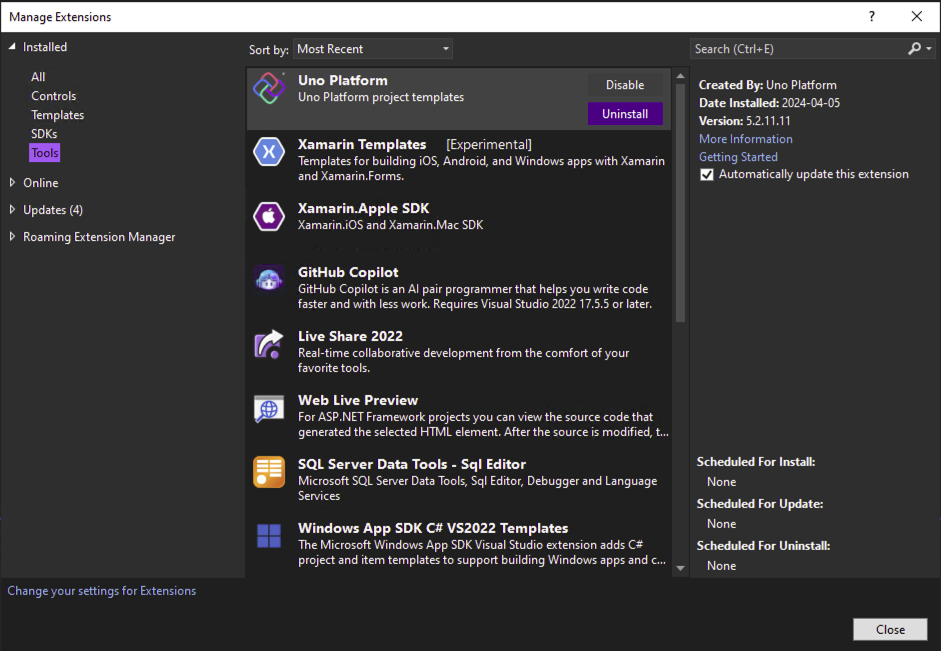

# Module 1 - Getting Started

Uno Platform provides a multi-platform solution for building native apps for iOS, Android, Windows, macOS, Web, as well as Linux.

This module will walk you through the process of getting started with Uno Platform and creating a project using either the template wizard or the dotnet new template, that includes features to serve the requirements of this workshop.

If you are new to the Uno Platform, you may also want to check out [Uno Docs - Get Started](xref:Uno.GetStarted).

## Setting up the Environment

### Use Uno Check to verify your system is Uno Platform ready

If you are using Visual Studio, depending on the workloads that you have installed, your environment may already be ready to go. As a best practice or to help solve issues following Visual Studio updates, we recommend that you run the Uno Check tool to ensure that your environment is fully set up for Uno Platform app development.

1. Execute the following command in the command line terminal (the current folder of the terminal doesn't matter):

    ```bash
    dotnet tool install --global Uno.Check
    ```

    If the tool is already installed, replace `install` with `update`.

    [Click here](xref:UnoCheck.UsingUnoCheck) to view the Uno Check tool docs.

1. Once installed, run the tool by executing the following command:

    ```bash
    uno-check
    ```

> [!NOTE]  
> You may need to take additional steps if trying to build the Linux or GTK heads on Windows.
> Be sure to follow the [Additional setup for Linux or WSL](xref:Uno.GetStarted.Linux) docs.

### Installing Uno Platform extensions and templates

# [Visual Studio](#tab/vs)

Make sure the latest version of the [Uno Platform extension for Visual Studio 2022](https://marketplace.visualstudio.com/items?itemName=unoplatform.uno-platform-addin-2022) is installed, by following [these instructions](xref:Uno.GetStarted.vs2022#install-the-solution-templates).

This extension includes the Uno Platform project templates.



# [Visual Studio Code or others](#tab/vscode)

If you're using Visual Studio Code, make sure to install the latest version of the Uno Platform extension [Visual Studio Code Marketplace](https://marketplace.visualstudio.com/items?itemName=unoplatform.vscode)


We will also install Uno Platform project templates using the command line interface. To ensure the templates are installed, run the following command:

```bash
dotnet new install Uno.Templates
```

> [!NOTE]  
> Make sure the latest version of the Uno.Templates version is installed.
> If you have already installed this in the past, you can update the current templates by running the following:
>
> ```bash
> dotnet new update
> ```

Now that the templates are installed we can list the options for the `unoapp` template with the following command:

```bash
dotnet new unoapp -?
```

---

## Obtaining a YouTube Data API v3 Key [optional]

This app will eventually search and play YouTube videos. To query this data from YouTube, a YouTube API v3 needs to be obtained. You can skip this part if you prefer running the app with local sample search data instead.

In the following steps, we will walk you through [this tutorial](https://developers.google.com/youtube/v3/getting-started), and provide you with detailed screenshots on how to obtain a YouTube Data API v3 key.

[!INCLUDE [Google API key instructions](google-api-key.md)]

## Creating the project

To create a new Uno Platform app, there are two options available to developers. The first is to use the Visual Studio extension which provides a guided approach to creating an Uno Platform app.
The other one is to use the dotnet new `unoapp` template, which enables customizing the generated projects with parameters and modifiers.

In the following sections, we will cover both methods for creating a new Uno app, providing step-by-step instructions for each.

# [Using the Uno Platform solution template wizard for VS](#tab/vs)

[!INCLUDE [Template wizard](templates-wizard.md)]

# [Visual Studio Code or other](#tab/vscode)

[!INCLUDE [Template CLI](templates-cli.md)]

---

You might be asked to reload the IDE before the projects are fully loaded. Click reload if you see this message.

  

## Rename files

1. Rename the file *Presentation* → *SecondModel.cs* to *VideoDetailsModel.cs*, and *SecondPage.cs* to *VideoDetailsPage.cs*.  
    If you're using Visual Studio and you're asked to also rename all references of `SecondPage` and `SecondModel` click *Yes*.

    

1. In *VideoDetailsModel.cs*, ensure the record name has changed to `VideoDetailsModel`, otherwise change it manually.

1. In *VideoDetailsPage.cs*, ensure `SecondPage` has changed to `VideoDetailsPage` in both the class name and constructor, otherwise change it manually, then change `BindableSecondModel` to `BindableVideoDetailsModel`.

1. Make sure these references have also been changed in *App.cs*.

1. In *App.cs*, also rename the route map path from `Second` to `VideoDetails`:

    ```c#
    new RouteMap("VideoDetails", View: views.FindByViewModel<VideoDetailsModel>()),
    ```

As explained [in the intro](xref:Workshop.TubePlayer.Overview#tube-player-workshop), the app will consist of two pages, a search page, and a video-player page. *MainPage.cs* and *MainModel.cs* will be used as the search page, whereas *VideoDetailsPage.cs* and *VideoDetailsModel.cs* to display additional video details and the media player.

## Running the application

1. Ensure a startup project is selected. Either right-click the desired project head in Solution Explorer (e.g. *TubePlayer.Mobile*) and select *Set as startup project*, or select this project from the Startup projects dropdown.
    When selecting *Mobile*, you could then select which mobile platform to run and on which emulator.  
    The emulator can be selected from the subsequent menu as shown in the picture:

    

1. Press <kbd>F5</kbd> to run the project.  
  This is what you expect the app to look like:

    

> [!NOTE]  
> If you see an error message mentioning the old type names (*SecondPage*/*SecondModel*), try cleaning the solution. In Visual Studio, you'd right-click the solution and then *Clean*. Otherwise, call `dotnet clean` from the `TubePlayer`'s solution folder.

To learn more about debugging the app on different platforms read this:

# [Visual Studio](#tab/vs)

[Debug in Visual Studio](xref:Uno.GetStarted.vs2022#create-an-application)

# [Visual Studio Code or others](#tab/vscode)

[Debug in Visual Studio Code](xref:Uno.GetStarted.vscode#run-and-debug-application)

---

## Additional Resources

- [Uno Docs - Getting Started](xref:Uno.GetStarted)

**[Next](xref:Workshop.TubePlayer.BasicLayout "Creating basic UI layout with C# Markup")**
